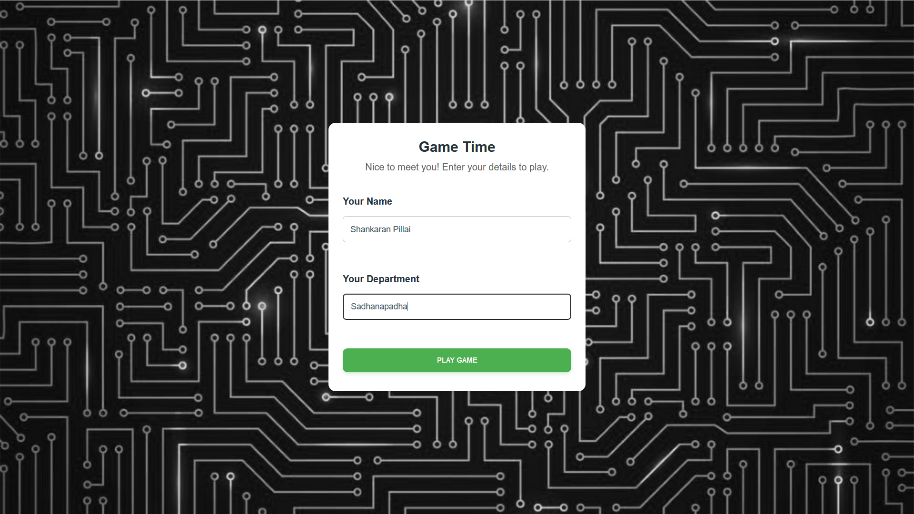
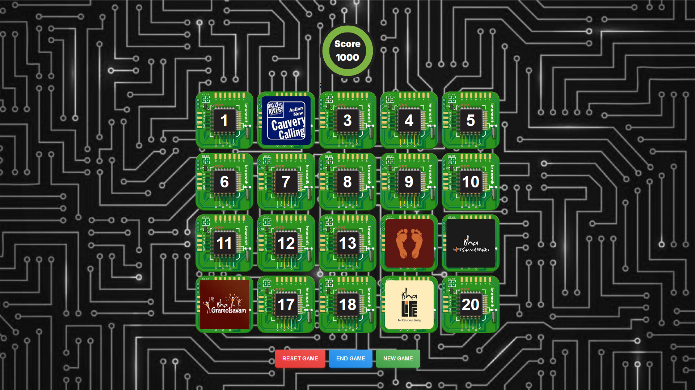
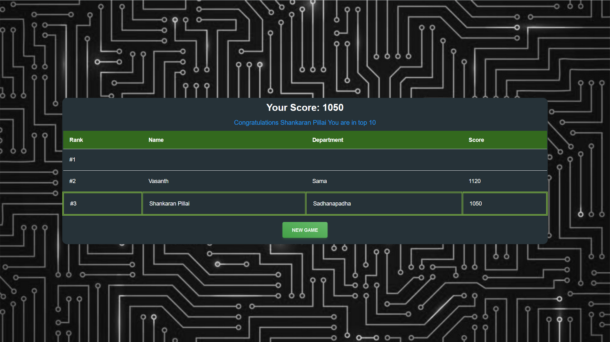

# Memory

> Memory Game with [Isha's Conscious planet](https://consciousplanet.org/en) initiative logos. 
> Thanks to Ashwin for image assets.
>- [Forked from Caian Mem game](https://caian.dev/posts/create-memory-game-with-nextjs/) this project


## Techs

- [Next.js](https://nextjs.org/)
- [ReactJS](https://react.dev/)
- [TypeScript](https://www.typescriptlang.org/)
- [TailwindCSS](https://tailwindcss.com/)
- [React Testing Library](https://testing-library.com/)

## Local Setup

Install dependencies

```sh
npm install
# or
yarn
```

Start the development server

```sh
npm run dev
# or
yarn dev
```

Open [http://localhost:3300](http://localhost:3300) with your browser.

## Out put



